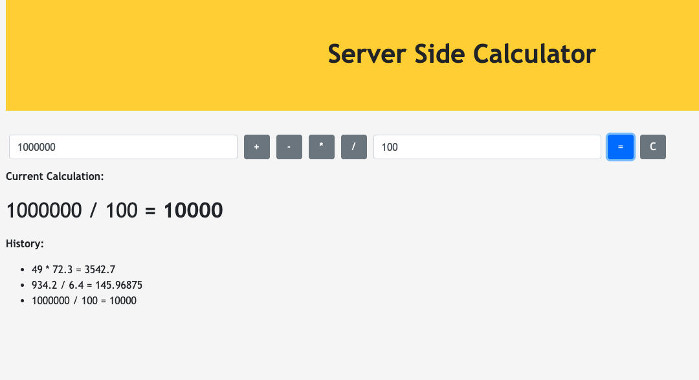

# Server Side Calculator

Server Side Calculator is a project that relies on jQuery to make server requests (using ajax) and to display information dynamically on the DOM. It allows a user to input two numbers, select an operator, evaluate the expression, and clear the input fields. As the name implies, all the calculation is done on the server rather than the client.

## Built With

JavaScript, jQuery, Node.js, Express.js

## Getting Started

These instructions will get you a copy of the project up and running on your local machine for development and testing purposes.

### Prerequisites

- [Node.js](https://nodejs.org/en/)

### Installing

Steps to get the development environment running.

1. Download this project.
4. In the terminal, `npm install` in the project folder
5. In the terminal, `npm start`

## Screen Shot

## Documentation

### Completed Features

App allows users to

- [x] Input 2 numbers and use 4 different operators in their expression
- [x] Calculate the expression or clear the inputs
- [x] See the calculator history below the current expression

## Deployment

[Currently deployed on Heroku](https://shrouded-depths-93852.herokuapp.com/)

## Authors

* Thomas Roselyn

## Acknowledgments

* Prime Digital Academy